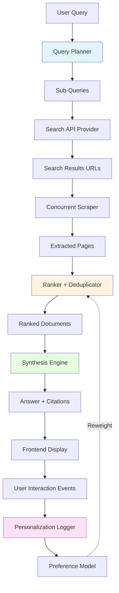

# Better-Perplexity: Project Blueprint

**Version:** 1.1  
**Last Updated:** October 2, 2025  
**Status:** 🟢 Core pipeline operational, production-ready

---

## 1. Overview & Goals

**Better-Perplexity** is a transparent search assistant that answers questions with cited sources. The core contribution is **adaptive personalization**: the system learns user preferences from implicit feedback (clicks, dwell time) and reweights ranking signals accordingly.

### Core Pipeline

Query → Plan sub-queries → Search & scrape → Rank & dedupe → Synthesize answer with citations

### Key Differentiators

- **Transparency:** Users see why each source was chosen and how sub-queries were planned.
- **Personalization (Main Technical Contribution):** Learns from user interactions to personalize rankings using rule-based reweighting (with option for ML upgrade).
- **Verifiable Citations:** Every claim links to specific source passages.

### Success Criteria

- Demo-ready in 60 seconds: query → plan → answer with citations
- Working personalization: event logging + rule-based preference learning
- 3-5 test queries validated end-to-end

---

## 2. User Experience

1. User enters query → System displays 2-4 sub-queries it will search
2. Progress indicator while fetching ~10 sources
3. Answer appears with inline citations `[1,2]`
4. Evidence panel shows source cards with "why chosen" badges
5. Click citation → highlights source passage
6. User interactions (clicks, dwell, saves) feed personalization

**Demo Path (60s):** Query → plan → sources load → answer with citations → click citation to see evidence → highlight personalization tooltip

---

## 3. Architecture

**Stack:**
- **Frontend:** React + TypeScript, Vite, TanStack Query, Tailwind + shadcn/ui, Zod validation
- **Backend:** Node/Express + TypeScript, Zod schemas, SQLite cache, OpenAI SDK
- **External:** Brave Search API, Cheerio + Mozilla Readability for scraping
- **LLM:** Structured outputs via Zod, temp 0.2 for planning, 0.5 for synthesis

### Data Flow Diagram



---

## 4. Core Modules

**Query Planner:** LLM decomposes query into 2-4 sub-queries using few-shot prompts. Validates max 4 sub-queries. Falls back to single query if input is narrow.

**Search Provider:** Abstracts search APIs (Brave/SerpAPI/Bing) behind `ISearchProvider` interface. Normalizes results to `SearchResult` schema (title, URL, snippet, domain, date).

**Scraper:** Fetches URLs with timeout, applies Mozilla Readability, extracts metadata. Falls back to snippet if extraction fails.

**Ranker:** Scores documents using BM25 relevance + recency + source quality (.edu boost) + coverage. Deduplicates near-matches. **Personalization hook applies learned weights here** (see next section).

**Synthesis:** LLM generates answer from top 8-10 docs. System prompt enforces citations `[N]`. Validates citations post-generation.

---

## 5. Adaptive Personalization ⭐ (Core Technical Contribution)

**Goal:** This is the main differentiator. Learn user preferences from implicit feedback and personalize ranking.

### Step 1: Event Logging

Track user interactions:
- `SOURCE_CLICKED`, `CITATION_HOVERED`, `SOURCE_EXPANDED`, `ANSWER_SAVED`
- Schema: `{ userId, timestamp, eventType, sourceId, queryId, metadata }`
- Storage: SQLite append-only log

### Step 2: Rule-Based Reweighting (MVP Implementation)

Compute simple preference signals from logged events:
- **Domain TLD preference:** If user clicks .edu sources 70%+ of the time, boost .edu domains +0.2
- **Recency preference:** If user clicks fresh sources (< 30 days) >60%, boost recency signal +0.3
- **Content type preference:** Track clicks by content type (news/blog/paper); boost preferred type +0.15

Apply these weights to ranker signals **before** final scoring.

**Cold start:** Use global defaults until user has ≥10 interactions.

**Privacy:** Anonymous user ID (LocalStorage), clear history button, opt-out banner.

### Step 3: LLM-Based Dynamic Feature Learning (Planned Enhancement)

**Current:** Rule-based reweighting on static features (TLD, recency, content type)  
**Planned:** LLM-powered semantic feature extraction and preference learning

**Approach:**
1. **Feature Extraction:** Use LLM to tag sources with semantic features:
   - Topic depth (introductory, intermediate, expert)
   - Writing style (academic, journalistic, conversational)
   - Information density (high, medium, low)
   - Formality level, recency signals, source authority
2. **Preference Learning:** Track which feature combinations user prefers via clicks
3. **Personalized Ranking:** Boost sources matching learned feature preferences
4. **Storage:** Per-user SQLite database for events and learned weights

**Benefits over rules:**
- Adapts to nuanced preferences beyond static categories
- Discovers user preferences LLM can express but rules can't capture
- More scalable as features expand

**Implementation note:** Current MVP uses Step 2 (rules). Step 3 is high-priority enhancement.

---

## 6. Stretch Features (Time Permitting)

**MMR Diversity Slider:** UI control to trade relevance (λ=1) vs diversity (λ=0). Updates ranking in real-time.

**Answer-Time Metrics:** Display quality badge (relevance@k, recency score, diversity) to build trust.

---

## 7. Key Data Contracts

**RankedDoc:**
```json
{
  "id": "string", "url": "string", "title": "string", "excerpt": "string",
  "score": "number",
  "signals": { "relevance": "number", "recency": "number", "sourceQuality": "number" },
  "rankingReason": "string (e.g., 'High relevance + .edu')",
  "domain": "string", "publishedDate": "string | null"
}
```

**AnswerPacket:**
```json
{
  "text": "string (markdown with [N] citations)",
  "citations": [{ "index": "number", "sourceId": "string", "passage": "string" }],
  "sources": "RankedDoc[]"
}
```

**UserEvent:**
```json
{
  "userId": "string", "timestamp": "string", 
  "eventType": "SOURCE_CLICKED | CITATION_HOVERED | SOURCE_EXPANDED | ANSWER_SAVED",
  "sourceId": "string", "queryId": "string"
}
```

---

## 8. Project Setup

**Prerequisites:** Node 20+, npm, Brave Search API key (paid tier recommended), OpenAI API key

**Repo Structure:**
```
/web        # React + Vite frontend (src/app, src/features/search, src/components, src/lib)
/server     # Express backend (src/routes, src/providers, src/scraper, src/ranker, src/llm)
/docs       # Project documentation
```

**Quick Start:**
```bash
npm install
# Create .env file in root with your API keys (see ENV_SETUP.md)
npm run dev              # Starts both frontend (5173) and backend (3001)
```

**Important Notes:**
- Brave Search API: Paid tier recommended for parallel search (5 concurrent queries)
- After upgrading Brave plan or changing API keys, restart the server (kill port 3001)
- Watch mode does NOT reload environment variables automatically

**Commands:**
- `npm run dev` — Start development servers
- `npm test` — Run tests (Vitest)
- Kill stuck server: `lsof -ti:3001 | xargs kill -9`

---

## 9. Milestones

**M1: Scaffold** ✅ COMPLETE — Monorepo setup, health check endpoints, `.env` config working

**M2: Core Pipeline** ✅ COMPLETE — Query planner → parallel search → scrape → rank → synthesize answer with citations
  - M2.1: Query planning with LLM ✅
  - M2.2: Answer synthesis with citations ✅
  - M2.3: Parallel search & intelligent merging ✅
  - M2.4: Unique result ID generation (URL-based hashing) ✅

**M3: Personalization** 🟡 IN PROGRESS — Basic hooks implemented, major enhancement planned
  - Event infrastructure complete ✅
  - Rule-based reweighting logic (basic) ✅
  - Frontend event tracking wired ✅
  - TODO: Replace with LLM-based dynamic feature tagging (see Future Features)

**M4: Polish & Production** 🟡 IN PROGRESS — Core functionality verified, enhancements remaining
  - End-to-end pipeline validated ✅
  - Brave API integration (paid tier) ✅
  - React key uniqueness fixed ✅
  - TODO: Comprehensive README, demo script, additional tests

### Definition of Done (MVP)

- [x] `npm run dev` runs successfully; core pipeline functional
- [x] Query planner generates 2-5 sub-queries with LLM
- [x] Parallel search across all sub-queries with intelligent merging
- [x] URL deduplication with normalized comparison
- [x] Concurrent scraping + Mozilla Readability extraction
- [x] Multi-signal ranking (relevance, recency, source quality, coverage)
- [x] Personalization hooks applied when userId provided
- [x] Answer synthesis with inline citations `[N]`
- [x] Frontend displays answer, citations, sources, and plan chips
- [x] Citations clickable in UI, evidence panel interactive
- [x] User event logging (SOURCE_CLICKED, etc.)
- [x] End-to-end queries validated with real APIs
- [x] No React console warnings

### Future Features & Enhancements

**Priority: High**
- [ ] **LLM-based personalization:** Replace rule-based reweighting with dynamic feature tagging
  - Use LLM to extract semantic features from sources (topic, depth, style, formality)
  - Learn user preferences on these dynamic features vs. static rules
  - Per-user SQLite database for event history and learned preferences
  - Enables richer personalization beyond TLD/recency/content-type

**Priority: Medium**
- [ ] UI preferences panel for personalization control
- [ ] Comprehensive README with setup instructions
- [ ] Demo script for presentations
- [ ] Additional unit/integration tests
- [ ] Error boundary and fallback UI states

**Priority: Low**
- [ ] Performance monitoring dashboard
- [ ] Multi-provider search fallback (SerpAPI, Bing)
- [ ] Request caching layer (Redis/SQLite)

---

## 10. Current Pipeline (Implemented)

**Complete end-to-end flow:**

```
Step 1: USER QUERY
  "What are the latest developments in quantum computing in 2024?"

Step 2: QUERY PLANNING ✅
  LLM decomposes into 2-5 sub-queries
  → "quantum computing advancements 2024"
  → "quantum error correction 2024"  
  → "Google Willow quantum chip"
  → "IBM quantum roadmap 2024"

Step 3: PARALLEL SEARCH ✅ (NEW)
  Execute all sub-queries simultaneously with Promise.allSettled()
  - Query 1 → Brave Search → 10 results
  - Query 2 → Brave Search → 10 results (parallel)
  - Query 3 → Brave Search → 10 results (parallel)
  - Query 4 → Brave Search → 10 results (parallel)
  
  Merge & Deduplicate:
  - 40 total results
  - Normalize URLs (www, protocol, trailing slashes)
  - Interleave for diversity (top 3 from Q1, top 3 from Q2, etc.)
  - Result: 28 unique → top 20 selected
  
  Graceful degradation:
  - Partial failures: Continue with successful queries
  - All failures: Fallback to original query
  - Few results (<5): Supplement with fallback query
  
  Timing: ~4-5 seconds for 4 parallel searches

Step 4: CONCURRENT SCRAPING ✅
  Fetch & extract top 15 URLs in parallel
  - Mozilla Readability for clean content
  - 10-second timeout per page
  - ~12/15 typically succeed (paywalls/timeouts fail)

Step 5: RANKING & SCORING ✅
  Multi-signal scoring for each document:
  - Relevance (BM25-like text matching)
  - Recency (boost recent publications)
  - Source Quality (.edu domains +0.2)
  - Coverage (content length)

Step 6: PERSONALIZATION ✅ (if userId provided)
  Apply user-specific preference weights:
  - Domain TLD preference (boost .edu if user clicks them 70%+)
  - Recency preference (boost fresh content if user prefers it)
  - Content type preference (news/blog/paper tracking)
  - Cold start: Global defaults until ≥10 interactions

Step 7: ANSWER SYNTHESIS ✅
  LLM generates answer from top 8 documents
  - Enforces inline citations [1], [2], etc.
  - Extracts specific passages for each citation
  - Validates citation indices post-generation

Step 8: FRONTEND DISPLAY ✅
  - Answer with clickable citations
  - Source cards with "why chosen" badges
  - Plan chips showing sub-queries
  - Metrics bar (sources, timing)

Step 9: USER INTERACTION TRACKING ✅
  Events logged: SOURCE_CLICKED, CITATION_HOVERED, SOURCE_EXPANDED, ANSWER_SAVED
  → Feeds back into personalization
```

**Performance:** ~12-17 seconds end-to-end for complete answer with citations
- Parallel search: 4-5 seconds (5 concurrent queries)
- Concurrent scraping: 10-12 seconds (15 URLs)
- LLM synthesis: 2-3 seconds (GPT-4 Turbo)

**Key Innovation:** Parallel search execution (3-4x faster than sequential) with intelligent interleaved merging ensures diverse sources while maintaining relevance.

---

## 11. Production Notes & Recent Fixes

### Resolved Issues (Oct 2, 2025)

**✅ Brave API Rate Limiting (429 Errors)**
- **Problem:** Free tier couldn't handle 5 parallel searches per query
- **Solution:** Upgraded to paid Brave API plan with higher quota
- **Learning:** Parallel search requires paid tier; free tier limited to sequential queries

**✅ React Key Uniqueness Warnings**
- **Problem:** Index-based IDs (`brave-0`, `brave-1`) duplicated across parallel searches
- **Solution:** Implemented URL-based MD5 hash for unique IDs (`brave-a4f3c91e`)
- **File:** `server/src/providers/brave.ts` line 53
- **Impact:** Eliminated console warnings, improved React reconciliation

**✅ Environment Variable Reloading**
- **Problem:** Watch mode doesn't reload `.env` changes
- **Solution:** Kill server process (port 3001) and restart after env changes
- **Note:** Generate new API key after Brave plan upgrades

### Known Limitations

- **Basic personalization:** Rule-based reweighting on static features (TLD, recency)
  - Enhancement: Replace with LLM-based dynamic feature learning (high priority)
- **In-memory event storage:** User preference events stored in memory, lost on restart
  - Enhancement: Per-user SQLite database for persistent event history
- **Single search provider:** Only Brave API implemented
  - Enhancement: Add SerpAPI/Bing fallbacks per `ISearchProvider` interface
- **No request caching:** Every query hits external APIs
  - Enhancement: Implement Redis/SQLite cache for search results

### Performance Optimization Opportunities

1. **Cache frequently searched queries** (reduce API costs)
2. **Reduce scraping parallelism** (10 concurrent instead of 15)
3. **Implement streaming answer synthesis** (faster perceived performance)
4. **Add CDN for static assets** (faster frontend load)

---

**End of Blueprint**
